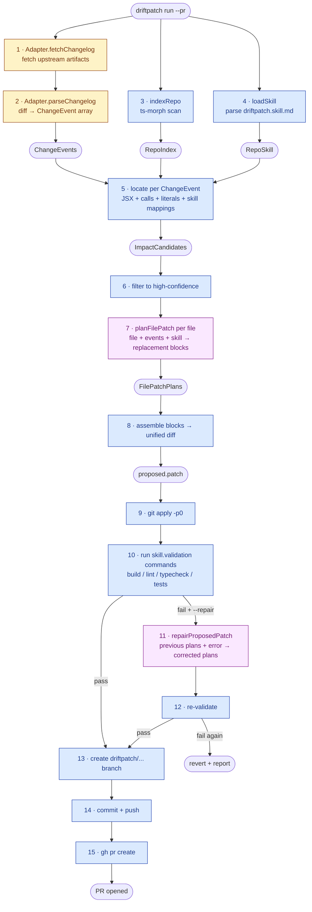
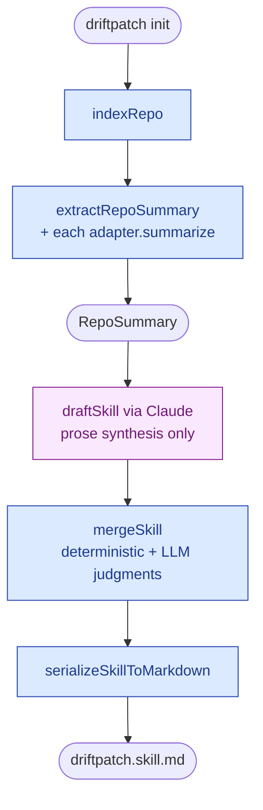
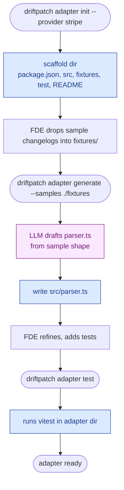

# How DriftPatch works

This doc walks through what happens when you run DriftPatch end-to-end, with two views of every step:

1. **Deterministic** vs **LLM-driven** — where the math is mechanical and where Claude is doing actual judgment work.
2. **Generic** (engine, ships with the tool) vs **Provider/FDE-specific** (per-upstream adapter) vs **Repo/customer-specific** (`driftpatch.skill.md`).

## The big picture

```
┌──────────────────────────────────────────────────────────────────────────┐
│                         Generic Engine (ships once)                      │
│   indexer · locator · patcher orchestration · validator · git/PR ops     │
└─────────────────▲─────────────────────────────────────▲──────────────────┘
                  │                                     │
   ┌──────────────┴───────────┐         ┌───────────────┴──────────────┐
   │   Provider Adapter       │         │   Repo Skill                  │
   │   (FDE-authored,         │         │   (init-generated +           │
   │   reused across orgs)    │         │   human-refined per repo)     │
   │                          │         │                               │
   │   • fetchChangelog       │         │   • provider mappings         │
   │   • parseChangelog       │         │   • validation commands       │
   │   • conventions          │         │   • areas + exclusions        │
   │   • summarize (optional) │         │   • patch policy              │
   └──────────────────────────┘         └───────────────────────────────┘
```

The engine never knows about Polaris specifically. The Polaris adapter never knows about a specific customer's repo. The skill is the bridge between the two.

---

## The `run` pipeline



**Legend:** blue = generic engine · yellow = provider adapter · pink = LLM call

### Step-by-step

1. **Adapter.fetchChangelog** — `[deterministic · adapter]` Pull the upstream artifact(s). For Polaris that's two CDN bundles by SHA. For a hypothetical Stripe adapter it'd be two OpenAPI specs by date. The adapter knows where to fetch and how.
2. **Adapter.parseChangelog** — `[deterministic · adapter]` Turn raw artifacts into `ChangeEvent[]`. For Polaris: load each bundle in a `node:vm` sandbox, capture `customElements.define()` calls + each class's observed attributes, structurally diff. For an adapter with no structured source, this step *can* be LLM-backed (the generic markdown adapter is) — but a structured-source adapter skips the LLM entirely.
3. **indexRepo** — `[deterministic · engine]` `ts-morph` scan of every TS/TSX file. Produces import graph, JSX usages with prop literals + un-aliased original names, identifier-like string literals with context, call sites with resolved import sources, and a symbol table.
4. **loadSkill** — `[deterministic · engine]` Parse `driftpatch.skill.md` (frontmatter + sections) into a `RepoSkill`. Provider mappings here are the highest-signal input the engine has about *this specific repo*.
5. **locate** — `[deterministic · engine + adapter conventions]` Per `ChangeEvent`, scan the index using the adapter's `conventions` (entity prefix, naming style) to compute name variants and the skill's provider mappings to upgrade confidence. Matches against JSX usages, call sites (e.g. `stripe.checkout.sessions.create`), and string literals (e.g. `"payment_intent.succeeded"`). Each candidate carries a confidence (high/medium/low) and a reason.
6. **Filter to high-confidence** — `[deterministic · engine]` V1 only patches high-confidence files. The locator is conservative on purpose: better to miss a low-signal site than to pollute a PR with random touches.
7. **planFilePatch** — `[LLM · engine]` This is the load-bearing LLM call. The model gets one file, the events affecting it, and the skill subset; it returns a `FilePatchPlan` with status (`patch` / `skip` / `manual_review`) and `ReplacementBlock[]` (`oldText` → `newText` + reasoning). Hard rules in the prompt: `oldText` must be an exact, unique substring; preserve indentation; don't invent APIs. The model never computes line numbers — that's deterministic post-processing.
8. **assemble** — `[deterministic · engine]` For each plan: read the file, apply blocks in order (refusing on missing or duplicate `oldText`), use the `diff` package to produce a unified diff. The diff is *ours*, not the model's — that's why we can trust it to apply.
9. **git apply -p0** — `[deterministic · engine]` First a `--check` dry-run, then real apply. Fails loudly if anything is off.
10. **Validate** — `[deterministic · engine]` Run each command from `skill.validation.commands` (typecheck, lint, tests, build). Capture stdout/stderr, time it, stop on first failure by default.
11. **repairProposedPatch** — `[LLM · engine, only on failure with `--repair`]` One-shot fix. Send back the previous plans, the sliced validation error (last ~80 lines of the failing command), the current file contents, and the skill. Get back corrected `FilePatchPlan[]` plus an explanation of what went wrong.
12. **Re-validate** — `[deterministic · engine]` Same as step 10. If it fails again, revert and report; no looping.
13. **Branch** — `[deterministic · engine]` Create `driftpatch/<provider>/<from>-<to>-<suffix>` from the current branch.
14. **Commit + push** — `[deterministic · engine]` Commit with a templated message, push to `origin` with upstream tracking.
15. **`gh pr create`** — `[deterministic · engine]` Body is a structured migration doc generated from the events + plans + validation results. Includes a "files considered but not modified" collapsed section so reviewers can see what the locator skipped.

**The working tree is reverted at every exit path.** If validation fails and we don't repair, revert. If repair fails, revert. If push fails, the branch we created stays in place but `master` is untouched.

---

## The `init` pipeline



The summary is *almost* the whole skill. Repo name, language, package manager, and validation candidates come straight from `package.json` and the lockfile. Provider mappings come from each adapter's `summarize(index)` method (Polaris: scan JSX `<s-*>` + `createElement('s-*', ...)` calls, score wrapper-candidate files by path hints). Top-scoring candidate per element is usually the right answer — the LLM only writes prose (one-line repo description, area patterns, suggested exclusions) and confirms ambiguous picks.

For react-polaris-web-components specifically: 57 wrapper mappings produced in one Sonnet 4.6 call, ~$0.05.

---

## The adapter authoring (FDE) pipeline



The FDE doesn't write LLM call code. They scaffold, drop in samples, refine the model's draft, add fixtures with assertions, and the engine handles the rest forever. A second adapter is half-day work.

---

## What's deterministic, what's LLM

| Step | Deterministic | LLM |
|---|---|---|
| Adapter fetch | ✓ | |
| Adapter parse (Polaris bundle differ) | ✓ | |
| Adapter parse (generic markdown fallback) | | ✓ |
| Repo indexing (ts-morph) | ✓ | |
| Skill loading + zod validation | ✓ | |
| Locate (name variants + skill mappings + match against index) | ✓ | |
| Confidence filtering | ✓ | |
| **planFilePatch (replacement blocks)** | | ✓ |
| Block assembly → unified diff | ✓ | |
| `git apply --check` and apply | ✓ | |
| Run validation commands | ✓ | |
| **repairProposedPatch** | | ✓ |
| Branch / commit / push / `gh pr create` | ✓ | |
| **Init: prose drafting (descriptions, area patterns, exclusions)** | | ✓ |
| Init: provider-mapping picks | mostly ✓ (top score) | LLM confirms ambiguous |
| Init: deterministic facts (name, scripts, package manager) | ✓ | |
| **Adapter generate (parser drafting from samples)** | | ✓ |

**The LLM has exactly five jobs in the whole system:**

1. Generate the patch (per impacted file)
2. Repair the patch when validation fails
3. Write the prose parts of the skill at init time
4. Confirm ambiguous wrapper picks at init time
5. Draft an adapter parser from sample changelogs (FDE workflow)

Everything else is mechanical. Critically, **the LLM never produces a unified diff or computes line numbers** — it emits old/new code spans and the engine assembles the diff. That's how we eliminate the most common LLM failure mode for code patches (wrong line numbers, off-by-one context).

---

## What's generic, what's provider-specific, what's repo-specific

| | Generic engine | Provider adapter | Repo skill |
|---|---|---|---|
| **Where it lives** | `@driftpatch/core` + `@driftpatch/cli` | `examples/adapter-<name>/` (FDE-authored, distributed via internal registry) | `driftpatch.skill.md` in the customer repo |
| **Reused across** | All providers, all repos | All customers using that provider | One repo |
| **Knows about** | Files, ASTs, ChangeEvent contract, git, gh CLI | Specific upstream artifact format (CDN bundle, OpenAPI spec, `.d.ts`, etc.) | Specific repo layout (wrapper paths, validation scripts, areas) |
| **Gets updated when** | The engine improves | Upstream changes its artifact format | The repo restructures |
| **Examples** | `indexRepo`, `locate`, `planFilePatch`, `assemblePatch`, `applyAndValidate` | `polarisAdapter.fetchChangelog` (CDN), `polarisAdapter.parseChangelog` (vm sandbox), `summarizePolaris` (find wrappers) | `s-checkbox → src/primitives/checkbox.tsx`, `pnpm typecheck` |

**The clean separation is what makes the next provider an FDE-day task.** Want Stripe? Write an OpenAPI-diff `parseChangelog`. Want OpenAI? Diff model lifecycle docs. Engine, locator, patcher, validator, PR pipeline — untouched.

---

## Real-world demo

Here's what an actual run looked like end-to-end, against the live `react-polaris-web-components` repo on GitHub:

> **Live PR**: https://github.com/Jaqito/react-polaris-web-components/pull/3
>
> 1. **Indexed the wrapper library** — found 50 files, loaded the 57-mapping skill.
> 2. **Computed 4 ChangeEvents** from the live Polaris CDN diff (`913ce26d` → `current`).
> 3. **Located impacts** — 2 high-confidence files via skill mapping (`checkbox.tsx`, `modal.tsx`).
> 4. **Patcher (Sonnet 4.6)** patched `checkbox.tsx`, skipped `modal.tsx` (its prop spread auto-forwards new attrs once types update).
> 5. **Validation FAILED** — `npm run typecheck`: `TS2339: Property 'labelAccessibilityVisibility' does not exist on type 'ReactProps$O & ReactBaseElementProps<Checkbox>'`. The exact real-world case where the installed `@shopify/polaris` types haven't shipped the new attribute yet.
> 6. **Repair LLM correctly diagnosed**: *"the installed type definitions don't have that key yet, causing TS2339. The fix is to type the new prop as `string` directly rather than indexing the not-yet-updated SCheckboxProps type."*
> 7. **Re-validate PASSED**: build ✓, lint ✓, typecheck ✓.
> 8. **PR pipeline**: branched, applied repaired patch, committed, pushed, `gh pr create` → **#3 opened**.
>
> **Total cost: ~$0.06** (initial patch $0.04 + repair $0.02). Whole thing took ~30 seconds wall-clock.

The repair step wasn't theatre — it actually fired and corrected a real type-system mismatch that would have made the PR fail CI. That's the load-bearing reason the LLM is in the loop at all: when reality (the installed types) doesn't match the spec (the new bundle's surface), something has to bridge the gap, and the model has the context to do it correctly.

---

## Future direction: more generic, more providers

V1 proves the architecture against one provider (Polaris) and one repo (`react-polaris-web-components`). The whole point of the engine + adapter + skill split is to make subsequent providers cheap. Future versions go in this direction:

**More adapters.** Each new upstream is a focused FDE day:
- **Stripe** — diff OpenAPI specs by API date; webhook event renames, endpoint param changes, deprecations.
- **OpenAI / Anthropic SDKs** — model lifecycle (deprecation dates) → rename `model: "..."` strings + tool schema changes.
- **Prisma** — diff `schema.prisma`; field renames, removals, and type changes ripple through `prisma.<model>.<op>` call sites.
- **Auth0 / Clerk** — middleware composition + callback URL changes; tests the locator's call-site + string-literal paths together.
- Anything with an OpenAPI spec, `.d.ts` package update, or GraphQL schema becomes a near-trivial adapter.

**More languages.** The indexer is TS/TSX-only today. The same architecture works for Python, Go, Ruby, Java — `ts-morph` swaps for `tree-sitter` + per-language extractors; everything downstream of `RepoIndex` is language-agnostic.

**More automation.** The current GitHub Actions workflow takes `from_sha` as a manual input. A baseline store (`.driftpatch/baselines/<provider>/latest.json`) auto-tracks the last-seen upstream version, so a scheduled cron just becomes "diff against latest, open PR if anything changed." From there, a polling-and-auto-trigger loop is a natural extension.

**Richer judgment.** The patcher is currently a single LLM call per file. Adding type-defs of the *new* SDK version into the prompt (already in the PRD) closes the hallucinated-API loophole. Auto-generated migration docs (LLM call over the existing artifacts) replace the current templated PR body. Patch-confidence scoring + blast-radius classification graduate the freeform `risk: low/medium/high` enum into a real gate for `auto_apply`.

**Better evals.** The current snapshot test catches deterministic regressions on one fixture. A real eval harness with multiple providers and graded outcomes (was the wrapper picked correctly, did the patch apply, did it pass validation, was there a known-good patch to compare against) becomes valuable once the second adapter ships and we need to know whether prompt changes improve averages, not just one case.

The thread connecting all of these: the engine doesn't change. Every one of the items above is either a new adapter (FDE work, isolated to its own package) or a generic-engine improvement (benefits every provider simultaneously). That's the test of whether the abstractions hold — and so far, they do.
